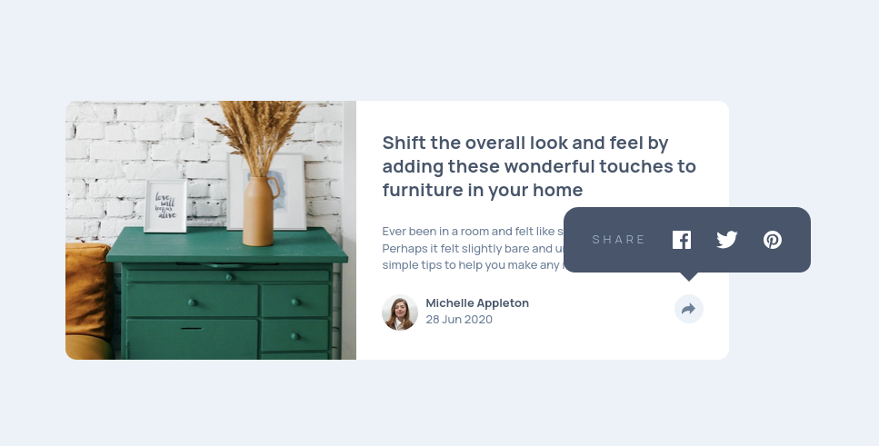

# Frontend Mentor - Article preview component solution

This is a solution to the [Article preview component challenge on Frontend Mentor](https://www.frontendmentor.io/challenges/article-preview-component-dYBN_pYFT). Frontend Mentor challenges help you improve your coding skills by building realistic projects. 

## Table of contents

- [Overview](#overview)
  - [The challenge](#the-challenge)
  - [Screenshot](#screenshot)
  - [Links](#links)
- [My process](#my-process)
  - [Built with](#built-with)
  - [What I learned](#what-i-learned)
  - [Useful resources](#useful-resources)
- [Author](#author)


**Note: Delete this note and update the table of contents based on what sections you keep.**

## Overview

### The challenge

Users should be able to:

- View the optimal layout for the component depending on their device's screen size
- See the social media share links when they click the share icon

### Screenshot




### Links

- Solution URL: [https://github.com/vanhog/frontend-mentor-article-preview](https://github.com/vanhog/frontend-mentor-article-preview)
- Live Site URL: [https://dees-frontend-mentor-article-preview.netlify.app/](https://dees-frontend-mentor-article-preview.netlify.app/)

## My process

### Built with

- Semantic HTML5 markup
- CSS custom properties
- Flexbox
- Mobile-first workflow
-  [Tailwindcss](https://tailwindcss.com)


### What I learned

- To call a snackbar a "snackbar" (or even a "toast") ;-)
- to use the classList Method 

```html
function showSomePopup() {
  	var thisIcon = document.getElementById('shareline');
  	
  	thisIcon.classList.toggle('hidden');
}
```
- using Tailwindcss and custom css classes together

### Continued development


### Useful resources

- [W3School's snackbar example](https://www.w3schools.com/howto/howto_js_snackbar.asp) - This helped me to figure out, how to handle snackbars.

- [Walid's article preview solution] (https://www.frontendmentor.io/solutions/article-preview-using-js-and-css-and-html-jrvhw5PHtb) - This helped me to apply the w3-example.

## Author


- Website - [Dieter H. Hoogestraat (Dee)](https://www.hoogestraat.com)
- Frontend Mentor - [@vanhog](https://www.frontendmentor.io/profile/vanhog)
